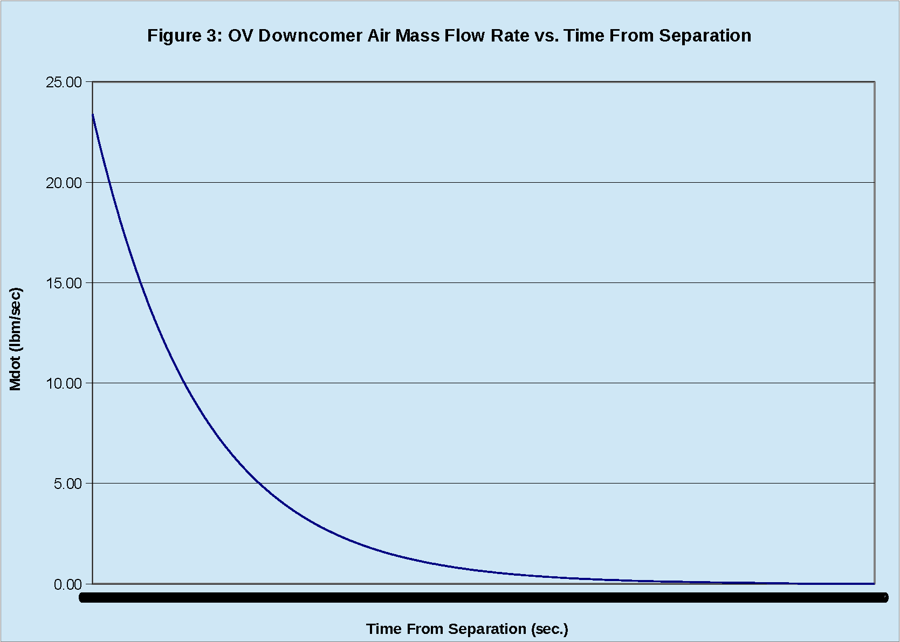

# ========================================
# Orbital Vehicle Blow Down From Separation Venting Analysis using VISSIM:
# ========================================

## Orbital Vehicle Blow Down From Separation Venting Analysis using VISSIM.

##
## I. Operation: "./VISSIM/OV_Blow_Down_from_Separation.vsm"

##
## II. Downcomer Air Flow Velocity vs. Time From Separation:

##
## III. Downcomer Air Flow Mach No. vs. Time From Separation:

##
## IV. Downcomer Air Mass Flow Rate vs. Time From Separation:

##
## V. OV Intertank Air Pressure vs. Time From Separation:

##
## VI. Blow Down From Separation Venting Analysis Top Level Diagram:

##
## VII. Plenum Sub-System Level Diagram:

##
## VIII. Input Sub-System Level Diagram:

##
## IX. Connectivity Sub-System Level Diagram:

##
## X. Output Sub-System Level Diagram:

##
## XI. Orifices Sub-System Level Diagram:

##
## XII. 1976 Stamdard Atmosphere Sub-System Level Diagram:

##
#### XXVa. Results: "./VISSIM/ov_intertank_h_q.out"
#### XXVb. Results: "./VISSIM/ov_intertank_mdot.out"
#### XXVc. Results: "./VISSIM/ov_intertank_plenum.out"
#### XXVd. Results: "./VISSIM/ov_intertank_temp.out"
#### XXVe. Results: "./VISSIM/ov_intertank_vel.out"

## 
## *Note: 
## 1. Performance Data and Analysis performed using VISSIM, ( https://web.solidthinking.com/vissim-is-now-solidthinking-embed )

